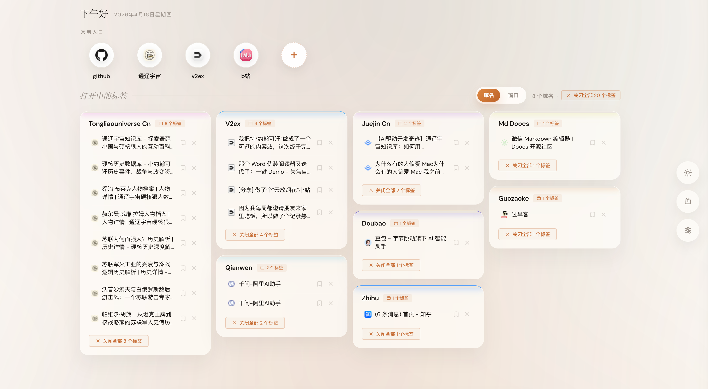
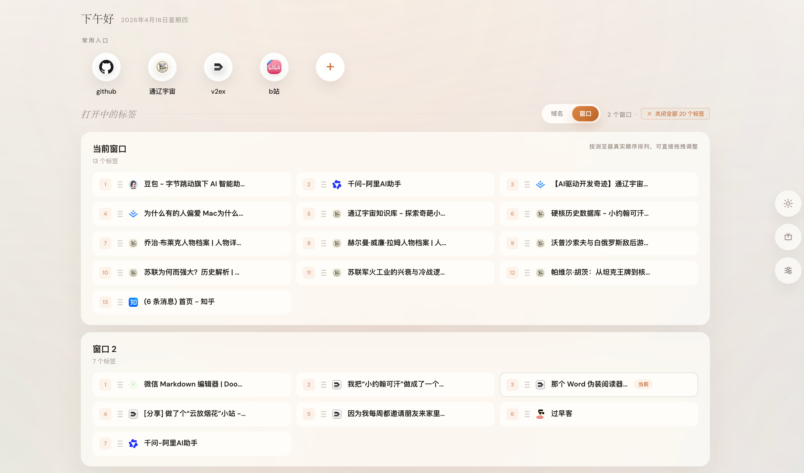
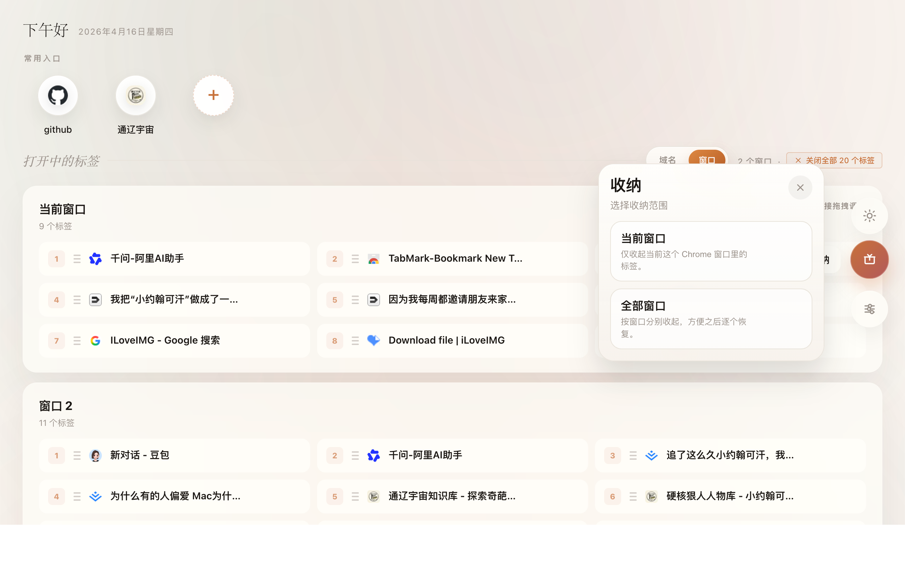
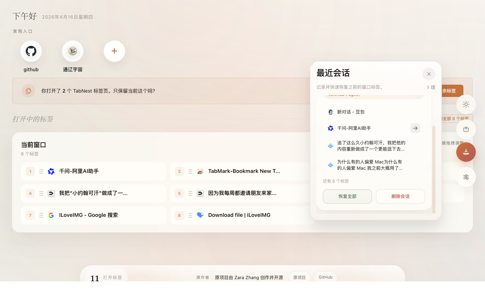
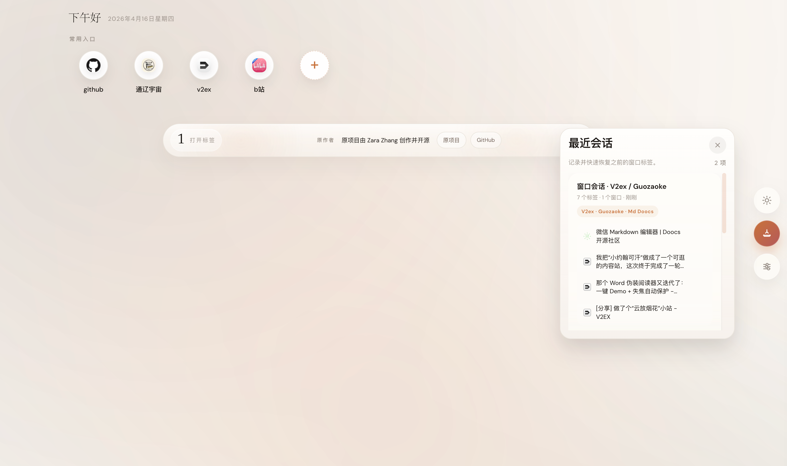

# TabNest

> A calm Chrome new tab workspace for organizing open tabs, bookmark boards, resource bundles, and restorable browsing sessions.

Language: [简体中文](README.md) | **English**

Repository: `Acorn2/tab-nest`



TabNest replaces Chrome's new tab page with a local-first dashboard for the tabs and links you already have open. The product name is **TabNest** and the GitHub repository is **`tab-nest`**. It groups open tabs by domain, lets you switch to a real window-order view, turns bookmark folders into launchable workspaces, and lets you stash a whole window or all windows for later restoration.

No server. No account. No tracking. Setup is just "load unpacked" and everything stays in your browser.

[](LICENSE)


## Why TabNest?

- **See open tabs clearly**: group all real web tabs by domain, with homepage-like tabs separated for faster cleanup.
- **Manage real Chrome windows**: inspect tabs by window and drag tabs in the window view to reorder the browser's actual tab strip.
- **Close clutter fast**: close one tab, close a whole domain group, or clean duplicate pages while keeping one copy.
- **Save before closing**: send a tab to the "Saved for Later" list before removing it from the current window.
- **Turn bookmarks into workspaces**: pin bookmark folders, search within them, batch-open selected links, and save selections as reusable resource bundles.
- **Stash sessions like OneTab**: save the current window or all windows, then restore the whole session or a single tab later.
- **Personalize the new tab page**: quick links, light/dark theme, Chinese/English UI, solid colors, and custom background images.
- **Stay local-first**: preferences, saved tabs, bookmark boards, and sessions live in `chrome.storage.local`.

## Screenshots

### Main Dashboard

The first screen combines quick links with domain-grouped open tabs, so you can understand the shape of your browsing session at a glance.


### Window View

Switch to the window view to see Chrome windows separately. Drag tabs inside a window to update the real browser tab order.



### Quick Stash

Stash only the current window or all open windows from the floating action dock.



### Recent Sessions

Saved sessions can be restored as a whole or opened tab by tab.



### Session Panel

The session panel keeps recently stashed windows close without turning the new tab page into another inbox.



## Install

TabNest is a pure Chrome extension. You do not need Node.js, npm, a backend service, or a build step.

### Option 1: Download The Package

Best for users who only want to install and use TabNest.

1. Open [Releases](https://github.com/Acorn2/tab-nest/releases).
2. Download the latest `tab-nest-v*.zip`.
3. Unzip it.
4. Open Chrome's extension manager.

```text
chrome://extensions
```

5. Enable **Developer mode** in the top-right corner.
6. Click **Load unpacked**.
7. Select the unzipped folder.
8. Open a new tab. TabNest should appear immediately.

### Option 2: Install From Source

Best for users who want to inspect the code or contribute.

1. Clone this repository.

```bash
git clone https://github.com/Acorn2/tab-nest.git
cd tab-nest
```

2. Open Chrome's extension manager.

```text
chrome://extensions
```

3. Enable **Developer mode** in the top-right corner.

4. Click **Load unpacked**.

5. Select the `extension/` folder in this repository.

6. Open a new tab. TabNest should appear immediately.

The folder you select should look like this after cloning:

```text
tab-nest/extension/
```

To update later, pull the latest code and reload the extension on `chrome://extensions`.

```bash
git pull
```

## Downloads And Releases

Install packages are published through GitHub Releases:

- Latest releases: [github.com/Acorn2/tab-nest/releases](https://github.com/Acorn2/tab-nest/releases)
- Current extension version: `1.2.0`
- Package naming: `tab-nest-v<version>.zip`

Maintainers can generate the install package with:

```bash
bash scripts/package-extension.sh
```

The script reads the version from `extension/manifest.json` and creates a file like:

```text
dist/tab-nest-v1.2.0.zip
```

See [docs/RELEASE.md](docs/RELEASE.md) for the release checklist.

## GitHub Repository Metadata

Suggested values for the GitHub About sidebar:

- **Description**: `A local-first Chrome new tab workspace for tabs, bookmarks, and restorable sessions.`
- **Website**: your GitHub Pages URL, if enabled
- **Topics**: `chrome-extension`, `manifest-v3`, `new-tab`, `tab-manager`, `bookmarks`, `productivity`, `local-first`

## Usage

### Open Tabs

- Click a tab title to jump to that tab, even if it lives in another Chrome window.
- Click the close button on a tab row to close just that tab.
- Click a group's close button to close every tab in that domain group.
- Use duplicate cleanup to keep one copy of repeated URLs.
- Toggle between **Domain** and **Window** views from the open tabs section.

### Bookmark Boards

- Open settings and choose one or more bookmark folders to pin to the homepage.
- Browse subfolders directly inside the board.
- Search within the current bookmark folder.
- Batch-select bookmarks and open them together.
- Save selected bookmarks as a reusable resource bundle.
- Delete individual bookmarks from Chrome when you intentionally clean them up.

### Sessions

- Use the floating stash button to save the current window or all windows.
- Restore an entire session or a single tab.
- Rename, pin, unpin, and delete saved sessions.
- Pinned sessions stay available after restore; temporary sessions are better for short-lived cleanup.

### Personalization

- Add quick links for frequently used sites.
- Choose whether quick links and bookmarks open in the current tab or a new tab.
- Switch between Chinese and English.
- Switch between light and dark themes.
- Use a solid background color or upload a custom background image.

## Permissions And Privacy

TabNest asks for the minimum browser permissions needed for its features:

| Permission | Why it is needed |
| --- | --- |
| `tabs` | Read, focus, close, and move browser tabs. |
| `storage` | Save preferences, quick links, saved tabs, bookmark board settings, resource bundles, and sessions locally. |
| `bookmarks` | Read selected bookmark folders, browse bookmark folders, and delete bookmarks when you choose that action. |
| `favicon` | Display site icons in tab, bookmark, and session lists. |

All application data is stored in `chrome.storage.local`. The extension does not include a server, analytics SDK, account system, or remote sync.

## Tech Stack

| Area | Implementation |
| --- | --- |
| Extension platform | Chrome Extension Manifest V3 |
| UI | Native HTML, CSS, and JavaScript |
| Storage | `chrome.storage.local` |
| Tab operations | `chrome.tabs` and `chrome.windows` APIs |
| Bookmark operations | `chrome.bookmarks` API |
| New tab replacement | `chrome_url_overrides` |

## Project Structure

```text
tab-nest/
├── extension/
│   ├── app.js
│   ├── background.js
│   ├── boot.js
│   ├── index.html
│   ├── manifest.json
│   ├── style.css
│   └── icons/
├── site-assets/
│   └── screenshots/
├── index.html
├── privacy-policy.html
├── LICENSE
├── README.en.md
└── README.md
```

## Development

There is no build pipeline. Edit files under `extension/`, then reload the unpacked extension from `chrome://extensions`.

Useful files:

- `extension/app.js`: dashboard state, rendering, tab actions, bookmark boards, sessions, settings, and localization.
- `extension/style.css`: all extension UI styles.
- `extension/index.html`: new tab page markup.
- `extension/background.js`: extension badge count updates.
- `index.html`: static GitHub Pages / product homepage.
- `site-assets/screenshots/`: product screenshots used by the website and this README.

## Roadmap Ideas

- Export and import local TabNest settings.
- Optional keyboard shortcuts for common cleanup actions.
- More session filters and search.
- Better onboarding inside the first new tab experience.
- Packaged release artifacts for easier manual installation.

## Credits

TabNest is derived from the original Tab Out project by Zara Zhang.

- Original author: [Zara Zhang](https://github.com/zarazhangrui)
- Original project: [tab-out](https://github.com/zarazhangrui/tab-out)

## License

[MIT](LICENSE)
